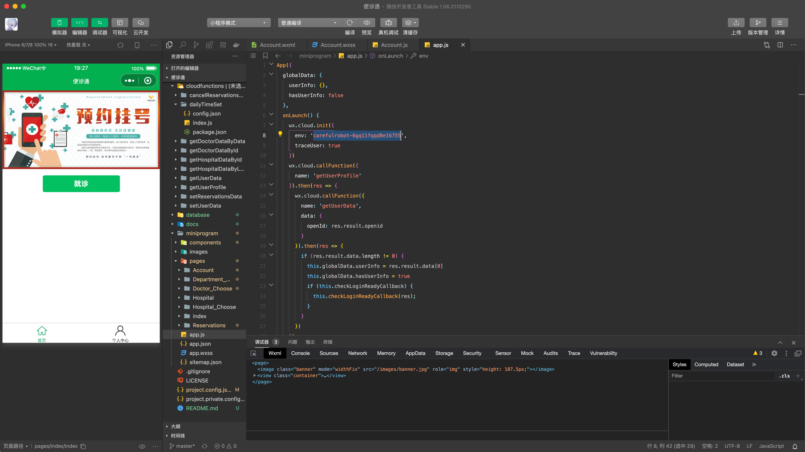
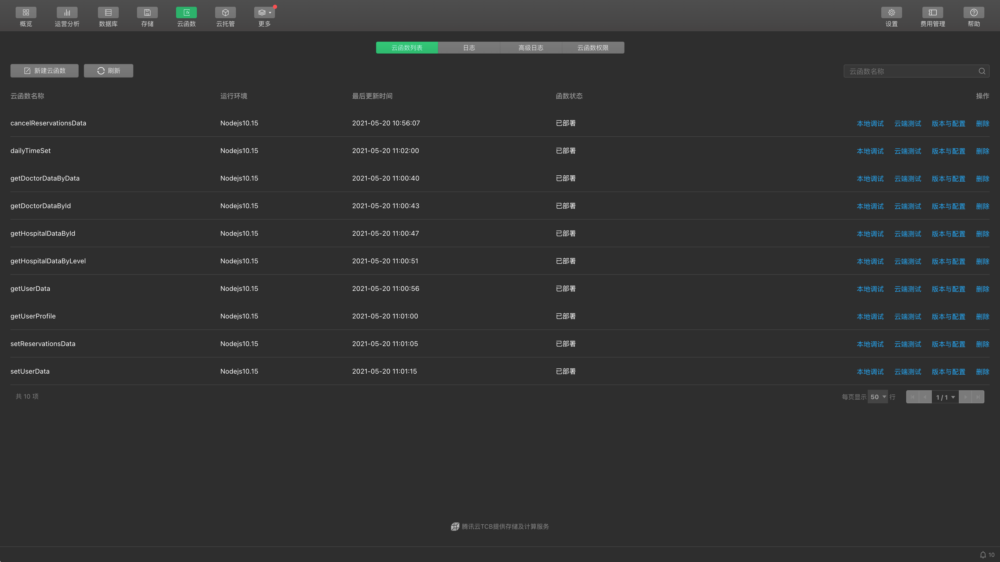
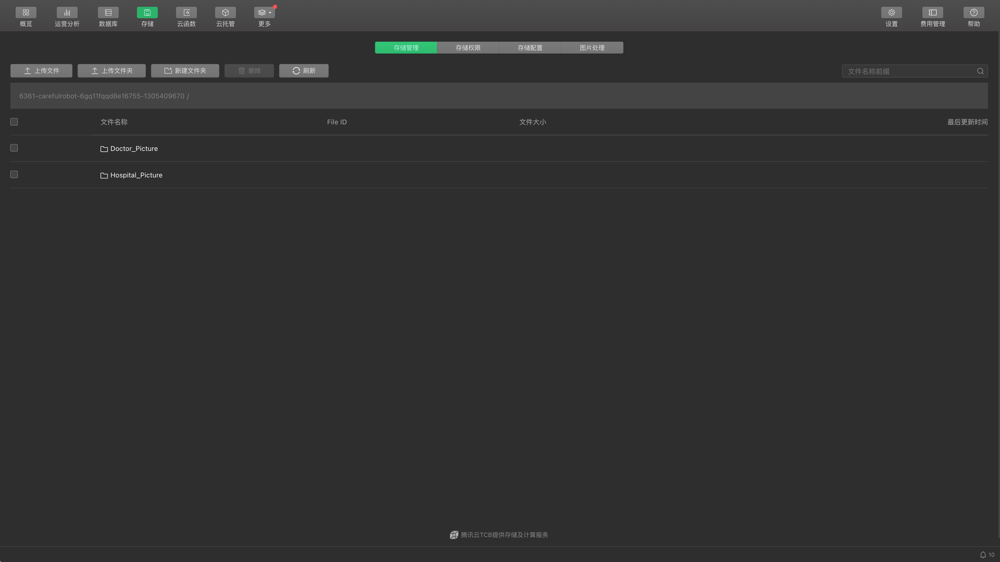
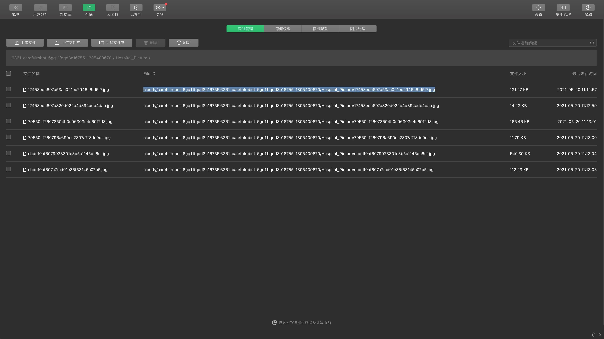
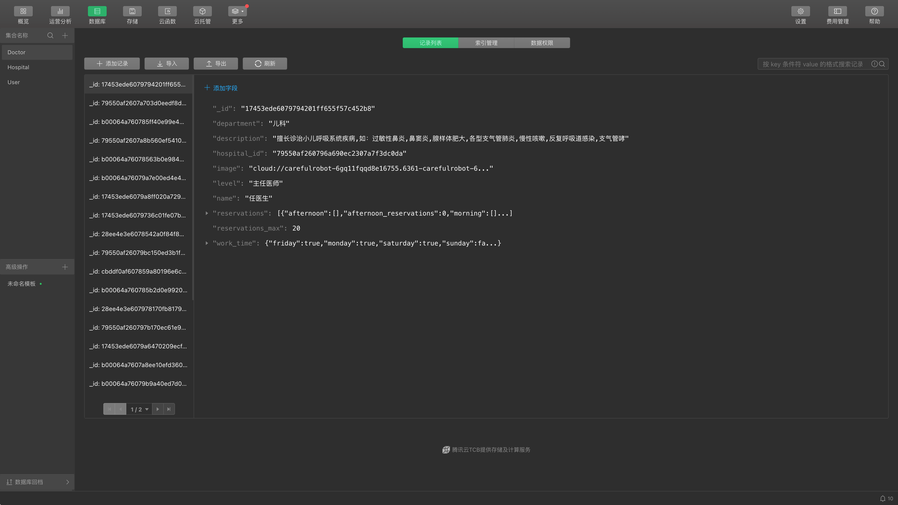
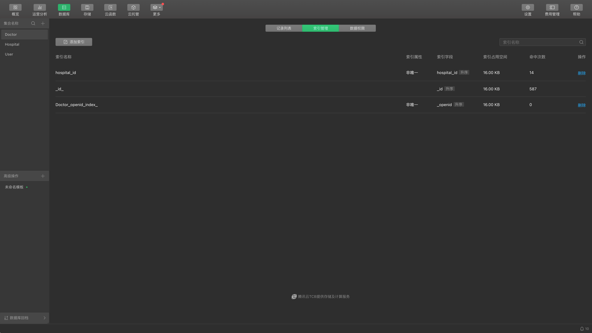

# 1 便诊通

便诊通是一个小型微信小程序练手项目

**注：本程序已经在2021年5月停止维护，里面部分代码已经不被支持（比如微信对用户信息获取的收紧），遇到问题请自行查阅[微信API](https://developers.weixin.qq.com/miniprogram/dev/framework)解决。**

# 2 部署方法

## 2.1 创建云环境

由于小程序完全使用微信自带`云环境`作为后端，所以需要创建`云环境`

在`微信开发者工具`中点击`云开发`即可配置一个`云环境`

## 2.2 配置云环境

### 2.2.1 配置环境ID

创建好`云环境`之后，复制你的`环境ID`，粘贴到[app.js](https://github.com/Careful-Robot/CDA/blob/WeChat/miniprogram/app.js)→onLaunch()→wx.cloud.init→env中，以及所有[云函数](https://github.com/Careful-Robot/CDA/tree/WeChat/cloudfunctions)中的cloud.init→env

### 2.2.2 部署云函数

将云函数全部部署到云环境中

### 2.2.3 部署存储

将[Doctor_Picture](https://github.com/Careful-Robot/CDA/tree/WeChat/database/Doctor_Picture)和[Hospital_Picture](https://github.com/Careful-Robot/CDA/tree/WeChat/database/Hospital_Picture)两个文件夹中的内容上传到云环境`存储`中

### 2.2.4 部署数据库

1. 复制`存储`中照片的`File ID`，替换到[Doctor.json](https://github.com/Careful-Robot/CDA/tree/WeChat/database/Doctor.json)和[Hospital.json](https://github.com/Careful-Robot/CDA/tree/WeChat/database/Hospital.json)中的`image`字段中。

2. 创建三个`集合`：`Doctor`、`Hospital`、`User`，并且将[Doctor.json](https://github.com/Careful-Robot/CDA/tree/WeChat/database/Doctor.json)和[Hospital.json](https://github.com/Careful-Robot/CDA/tree/WeChat/database/Hospital.json)导入到对应`集合`中。

3. 为`Doctor`集合`hospital_id`创建索引

# 3 数据库字段

## 3.1 `Doctor`集合

### 3.1.1 `Doctor`集合

|      字段名      | 数据类型 |               备注               |
| :--------------: | :------: | :------------------------------: |
|       _id        |  String  |       文档ID，微信自动生成       |
|       name       |  String  |             医生名字             |
|      level       |  String  |             医生等级             |
|    department    |  String  |               科室               |
|      image       |  String  |             头像地址             |
|   description    |  String  |               简介               |
|   hospital_id    |  String  |              医院ID              |
|    work_time     |  Object  |             上班时间             |
| reservations_max |  Number  |         每班最大预约人数         |
|   reservations   |  Array   | 预约情况（每天由云函数自动更新） |

### 3.1.2 `work_time`对象

|  字段名   | 数据类型 |     备注     |
| :-------: | :------: | :----------: |
|  monday   | Boolean  | 周一是否上班 |
|  tuesday  | Boolean  | 周二是否上班 |
| wednesday | Boolean  | 周三是否上班 |
| thursday  | Boolean  | 周四是否上班 |
|  friday   | Boolean  | 周五是否上班 |
| saturday  | Boolean  | 周六是否上班 |
|  sunday   | Boolean  | 周日是否上班 |

### 3.1.3 `reservations`数组

数组内每个都是一个对象

|         字段名         | 数据类型 |      备注      |
| :--------------------: | :------: | :------------: |
|        morning         |  Array   |  上午预约情况  |
|  morning_reservations  |  Number  |  上午预约人数  |
|       afternoon        |  Array   |  下午预约情况  |
| afternoon_reservations |  Number  |  下午预约人数  |
|          time          |  String  | 当日日期时间戳 |

### 3.1.4 `morning`和`afternoon`数组

数组内每个都是一个字符串，内容为已预约此医生的用户ID，无人预约为空

## 3.2 `Hospital`集合

### 3.2.1 `Hospital`集合

|        字段名         | 数据类型 |         备注         |
| :-------------------: | :------: | :------------------: |
|          _id          |  String  | 文档ID，微信自动生成 |
|         name          |  String  |       医院名字       |
|         type          |  String  |       医院类型       |
|         level         |  String  |       医院等级       |
|      department       |  Array   |         科室         |
|         image         |  String  |       头像地址       |
|          fax          |  String  |         传真         |
|        website        |  String  |         网站         |
|  emergencyRoom_phone  |  String  |      急救室电话      |
|      information      |  String  |         资讯         |
| informationDesk_phone |  String  |      咨询台电话      |
|        address        |  String  |         地址         |
|     trafficRoutes     |  String  |       乘车路线       |

### 3.2.2 `department`数组

数组内每个都是一个字符串，内容为科室名称

## 3.3 `User`集合

**注意：这其中大部分内容微信已经不提供，请留意程序是否会因此出错**

### 3.3.1 `User`集合

|     字段名     | 数据类型 |            备注            |
| :------------: | :------: | :------------------------: |
|      _id       |  String  |    文档ID，微信自动生成    |
|     openId     |  String  | 用户唯一识别码（微信提供） |
|    nickName    |  String  |    用户昵称（微信提供）    |
|   avatarUrl    |  String  |  用户头像地址（微信提供）  |
|     gender     |  Number  |    用户性别（微信提供）    |
|    country     |  String  |      国家（微信提供）      |
|    province    |  String  |      省份（微信提供）      |
|      city      |  String  |      城市（微信提供）      |
|    language    |  String  |      语言（微信提供）      |
| isReservations | Boolean  |        是否已经预约        |
|  reservations  |  Object  |          预约详情          |

### 3.3.2 `reservations`对象

|   字段名    | 数据类型 |             备注              |
| :---------: | :------: | :---------------------------: |
| hospital_id |  String  |            医院ID             |
|  doctor_id  |  String  |            医生ID             |
|    time     |  String  | 预约时间（morning/afternoon） |
|  timestamp  |  String  |        预约日期时间戳         |